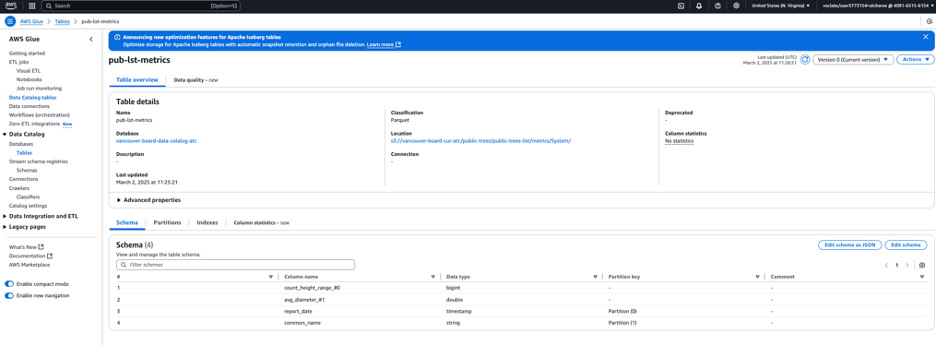
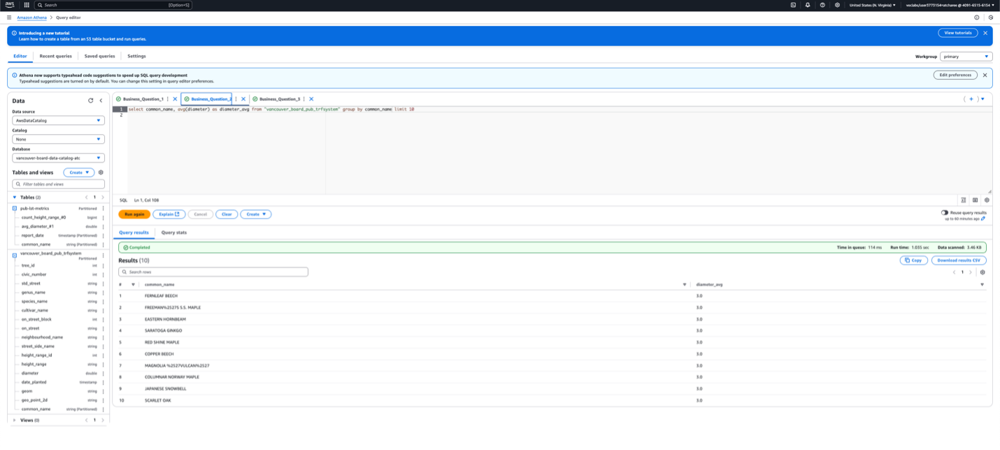

# 📊 DAP Design and Implementation: City of Vancouver Public Trees Dataset 📊

## 🟡 Project Description
This project focuses on designing and implementing a data analysis pipeline using AWS for the Public Trees dataset from the City of Vancouver. The goal is to allow quick analysis, provide insights into the trees' data, and ensure data security, governance, and monitoring using AWS services like Athena, S3, KMS, and CloudWatch.

## 🟡 Objective
The objective of this project is to enhance operational data through efficient cleaning, transformation, and analysis using AWS services. Key challenges such as missing data, outlier detection, and data inconsistencies are addressed to refine data quality. Ultimately, the goal is to provide meaningful, actionable insights that support critical business decisions and improve operational efficiency.
 
## 🟡 Dataset
The dataset consists of CSV files containing critical information such as University Name, Program ID, Student ID, Program Type, Enrolment ID, and Application ID. The data is stored securely in Amazon S3 and processed with AWS Glue DataBrew to perform necessary cleaning and transformations before being analyzed for business intelligence.

## 🟡 Methodology

### ▶️ 1. Data Ingestion
The initial phase involves securely uploading data to Amazon S3, ensuring the storage solution offers both high durability and availability for effortless access and management.

### ▶️ 2. Data Profiling
Utilizing AWS Glue DataBrew, the data undergoes a rigorous profiling process. This includes identifying missing values, inconsistencies, and detecting outliers within the dataset to ensure its integrity.

Lifecycle Configuration in Amazon S3 Buckets to manage objects so it will store effectlively throughtout it lifecycle.

### ▶️ 3. Data Cleaning
In this phase, missing values and data inconsistencies are resolved through imputation or removal techniques, ensuring a refined dataset that meets business requirements

Stored in System Version (.snappy)

Stored in User Version (.csv)

### ▶️ 4. Data Cataloging
Following the cleaning phase, the data is transformed into a consistent format, using AWS Glue Crawler ,which can help to define schema, data toye, and relationship across dataset.

### ▶️ 5. Data Summarization
AWS Glue’s Visual ETL tool is used to summarize key data insights in a clear, concise manner. This process distills complex data into understandable, actionable insights for stakeholders.

Data Cataloging Metrics

Stored in System Version (.snappy)

Stored in User Version (.csv)

### ▶️ 6. Data Analysis
Data Analysis will use for generate insights and reports. In this report will use Amazon Athena with SQL integrating to solve the Business Question.

Question 1: What is the average diameter of the trees?

Question 2: What is the average number of trees grouped by common name?

3.	Question 3: What is the most common species of trees in the dataset?

### ▶️ 7. Data Security
AWS Key Management Service (KMS) would use for manage encrypt and decrypt key to ensure all data will secure.

Additionally, The replication rules use to define options you want Amazon S3 to apply during replication such as server-side encryption, replica ownership, transitioning replicas to another storage class.

### ▶️ 8. Data Governance
AWS Glue was used in this step by adding condition to do a quality check (completeness, uniqueness, and Data Freshness) before analysis (ETL Pipeline). Moreover, it will improve the data quality to make informed decision in the future project.

1.	Completeness: Check the completeness of the “common_name” field in the dataset. The dataset will have at least 95% of the values must be non-null or filled.
2.	Uniqueness: Check for the uniqueness of the “tree_id” field, ensuring no duplicate cell exists. The dataset will have at least 99% of the values must be unique with no repetition.
3.	DataFreshness: Check the “date_planted” data is no older than 365 days, which helps ensure that data is current, fresh, and valid

After run the job the data would store seperately among these condetions.
Passed

Failed

### ▶️ 9. Data Monitoring
AWS CloudWatch would used to monitor resource usage and computer performance, On top of that, the system will send a alert to data team if the resource is exceeding the threshold, so the data team has to take action for this issue. AWS CloudWatch tracks key metrics as follows:

1.	S3 buckets size in 1 day within 15 minutes
2.	AWS Glue in resource usage in 5 minutes

## 🟡 Tools and Technologies

### ▶️ 1. AWS S3
Used for the secure and scalable storage of raw and processed datasets, ensuring reliable data accessibility.+

### ▶️ 2. AWS Glue
This managed ETL (Extract, Transform, Load) service facilitates data cleaning, transformation, and cataloging, helping to streamline data workflows.

### ▶️ 3. AWS Glue DataBrew
A no-code tool for data profiling and preparation, AWS Glue DataBrew empowers users to clean and transform datasets quickly with minimal technical knowledge required.

### ▶️ 4. AWS CloudWatch
A monitoring service for AWS cloud resources and the applications you run on AWS. CloudWatch is used to track key metrics like bucket size and job performance, allowing you to set up alarms and get notified when thresholds are exceeded. This helps in maintaining the health and performance of the data pipeline.

### ▶️ 5. AWS CloudTrail
Used for logging and monitoring AWS account activity. AWS CloudTrail ensures that every action related to your data pipeline (such as creating, modifying, or deleting resources) is tracked, providing transparency and helping to meet security and compliance standards.

## 🚀 Deliverables

### ▶️ 1. A comprehensive implemented AWS-based data analysis pipeline for the Public Trees dataset.
Data Ingestion, Data Profiling, Data Cleaning, Data Cataloging, Data Summarization, Data Analysis. Data Security, Data Governance, and Data Monitoring

### ▶️ 2. Business insights from the dataset 
(e.g., average tree diameter, average number of trees grouped by common name, and most common species of trees).

### ▶️ 3. Data security mechanisms (encryption via AWS KMS, bucket versioning).
Fully implemented how to secure the dataset, Who can access data (authorized person only)

### ▶️ 4. Data governance practices (quality checks for completeness, uniqueness, and freshness).
How to manage the dataset with governance techniques to obtain the better quality data.

### ▶️ 5. Monitoring dashboards via AWS CloudWatch.
How to create the dashboard and What can be monitored by CloudWatch (Bucket size, Resource Usage)

### ▶️ 6. Audit trails via AWS CloudTrail to ensure security compliance.
Track the user activity, who can access data, download, modify, and remove the data to enhance data security.

---

*Thank you for visiting my project! For any questions, feel free to reach out via [email](mailto:your-email@example.com) or visit my [LinkedIn profile](https://www.linkedin.com/in/your-linkedin).*
